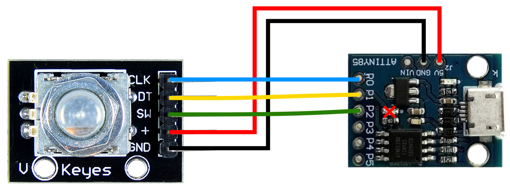

# Media Control Knob Attiny85
A Attiny85 powering Printables (Prusaprints) Media Control Knob that can act as a HID (can act as keyboard or mouse)
(Readme still work in progress + code needs a comment editing pass. But everything works and should be enough info you get you started)
## Description

This project builds off of [Mikolas Zuza Media Control Volume Knob](https://blog.prusa3d.com/3d-print-an-oversized-media-control-volume-knob-arduino-basics_30184/) but using a Attiny85 to reduce cost. The Attiny85 over usb can act as a Human Interface Device and any keypress or mouse press that your keyboard or mouse can make. 

From Aliexpress Clone Prices:

| Date         | Pro Micro (ATmega32U4)| Attiny85  | Difference | Attiny85 per one Pro Micro |
| ------------ | --------------------- | --------- | ---------- | -------------------------- |
| November 2019| $2.89                 | $1.07     | $1.82      | 2.7                        |
| April 2022   | $6.5                  | $2.45     | $4.05      | 2.65                       |  

From the table above (using personal Aliexpress order history data), when the Media Control Volume Knob guide was made in 2019 the cost difference between two popular microcontrollers with HID support was $1.82. Now 2.5 years later and the cost difference has doubled to $4.05. Without needed more pins (for example [remixes making a macro pad with volume control](https://www.printables.com/model/31773-macro-knob-and-keyboard)) the Attiny85 should be the right choice due to the recent chip price increases. 

## Hardware Required
* [3D printed base and knob by Mikolas Zuza](https://blog.prusa3d.com/3d-print-an-oversized-media-control-volume-knob-arduino-basics_30184/)
* Rotary Encoder
* Attiny85

## Getting Started

### Attiny85 DigiStump Board on Arduino IDE
[Read the DigitStump Wiki page here](https://digistump.com/wiki/digispark/tutorials/connecting "DigiStump Wiki") on how to get your Attiny85 set up for the Ardunio IDE but I will try to paraphrase below:
1. Install Digistump drivers from [https://github.com/digistump/DigistumpArduino/releases/download/1.6.7/Digistump.Drivers.zip](https://github.com/digistump/DigistumpArduino/releases/download/1.6.7/Digistump.Drivers.zip) running “DPInst64” (on 64bit systems). Installing them directly worked for me but manually setting drivers [as seen in this Youtube video](https://www.youtube.com/watch?v=MmDBvgrYGZs) that was linked on the Digistump Wiki and forums works as well for many people.
1. Add http://digistump.com/package_digistump_index.json to "Additional Boards Manager URLs" in Perferences.
2. Install "Digistump AVR Boards" from Tools -> Board -> Board Manager.
3. Use the "Digispark (Default - 16.5mhz)" board for programming.
4. When ready to program, leave your Attiny85 UNPLUGGED, press upload and wait for the bottom output box the Arduino IDE to ask to plug in the Attiny85. 

### Libaries Needed

* [ClickEncoder by soligen2010](https://github.com/soligen2010/encoder "ClickEncoder by soligen2010")
* [TimerOne by Paul Stoffrgen](https://github.com/PaulStoffregen/TimerOne "TimerOne") (import from github, import from library manager didn't support Attiny85)
* [TrinketHidCombo by Adafruit](https://github.com/adafruit/Adafruit-Trinket-USB/tree/master/TrinketHidCombo "TrinketHidCombo")

### Library editting
To work with Arduino IDE 1.8.19 we have to edit some of the libaries.

* Digistump Libaries: Go to C:\Users\[YourUserName]\AppData\Local\Arduino15\packages\digistump\hardware\avr\1.6.7, create a backup of the "libraries" folder (not in the same directory) and then delete the "libraries" folder. The v-usb files in Digitstump libaries causes conflict with v-usb files in TrinketHidCombo due to the Arduino IDE using the Digistump ones. (Fixes "Device Descriptor Request Failed" or "An unknown item was found in the report descriptor" Windows errors)
* TrinketKeyboard\usbdrv/usbdrvasm.S: Edit this file by adding before the `#define __SFR_OFFSET 0` (line 17)
```
#undef __SFR_OFFSET
 ```
 And at Line 73 change the `#if` to
 ```
 #if 0x41 < 0x40
 ```
 This is to fix the `#define __SFR_OFFSET 0` warning at compiling AND to fix "Device Descriptor Request Failed" or "An unknown item was found in the report descriptor" Windows errors. (From [Adafruit Trinket USB Issue 22](https://github.com/adafruit/Adafruit-Trinket-USB/issues/22) and [Issue 27](https://github.com/adafruit/Adafruit-Trinket-USB/issues/27)
 
### Hardware "editting"
The Attiny85 has a smd LED connected to P1 that needs to be removed as it interferes with the rotary encoder readings. You can desolder it, use needle-nosed pliers to break it off, or carfully use a screw driver to destroy it from the top.

I recommend desoldering the right-angle header pins on the rotary encoder and either solder wires directly (or resolder right-angle header pins coming out from the bottom of the rotary encoder if using dupont wires) due to little space you have to connect wires when the rotary encoder is sitting flush with the 3D printed base. 

## Wiring Diagram


## Media Control Knob Settings
### ClickEncoder encoder settings
* `encoder.setAccelerationEnabled(bool)` turns on or off acceleration. You can edit the acceleration speed settings in ClickEncoder.cpp
* `encoder.setDoubleClickEncabled(bool)` turns on of off double clicking. You can edit the speed of double clicking in ClickEncoder.h

### Attiny85MediaControlKnob.ino settings
* `setHeldSingleAction = bool;` turns on "button held" sending a single keypress (single action) or off for sending repeated keypress (as if you were holding a key down on a normal keyboard.) You can edit the hold time before action in ClcikEncoder.h
* `setMultipleKeySets = bool;` turns on being able to have mutilple key sets. In this project I use the double click to switch between keysets.

### Default / Project Keysets
By default this project uses the Attiny85 to act as a usb keyboard to control media with mulitple keysets. 
Keyset One (General media playback)
* Single click: Media Play/Pause
* Double click: Change Keyset
* Hold: *singleaction* Left-Alt + M
* Rotary Encoder Right: Media Volume Up
* Rotart Encoder Left: Media Volume Down

Keyset Two (Youtube)
* Single click: Spacebar
* Double click: Change Keyset
* Hold: *singleaction* Left-Alt + M
* Rotary Encoder Right: Right Arrow
* Rotart Encoder Left: Left Arrow

### Changing key bindings

I recommend reading TrinketHidCombo.h to view the available functions and KEYCODES. I will provide a few examples below:
```
TrinketHidCombo.pressKey(modifiers, keycode1, keycode2,..,keycode5); // modifiers like Alt, Ctrl, Shift, etc. Can use with upto five keycodes
TrinketHidCombo.pressKey(0,0);

TrinketHidCombo.pressMultimediaKey(keycode); //Multi Media keys such as PlayPause, Volume, etc
TrinketHidCombo.print("YourStringHere"); //Types out the string, great for debugging
```

### usbconfig.h Settings (Changing device name and other rules)
By default from the TrinketHidCombo library, the Attiny85 will be progammed to be a HID device that is:
* Vendor ID: 0x1782, Device ID: 0x24AB, which refers to a Vendor "Multiple Vendors" and unlisted Device ID.
* Vendor name: Adafruit, Device name: Trinket HID Combo, what will show up on your computers (for example in Windows->settings->devices will show the device name.

I don't believe that this is correct for the device desctription based on USB-IF standards since:
* A Vendor ID is $6,000 and can't find any resources relating to being able to "piggy-back" off of Vendor ID 0x1782.
* Adafruit's Vendor ID is 0x239A so not sure why they wouldn't for their Trinket Libabary set the Vendor and Device ID correctly (Adafruit has a device ID 0x081E as a "Trinket Mo")

So if you want to try to follow USB-IF standards then I encourge you to read [V-USB ID FAQ](https://github.com/obdev/v-usb/blob/master/usbdrv/USB-ID-FAQ.txt) and then [V-USB USB IDs for free](https://github.com/obdev/v-usb/blob/master/usbdrv/USB-IDs-for-free.txt) from the V-USB github. Following those guidelines, you can use Vendor ID 0x16c0 and Device ID based on your usecase. For example following the guidelines I used 0x27db for USB Keyboards (since only using common Keyboard keys in this project). Please note that the IDs are low byte first in usbconfig.h so using the Vendor ID, `#define  USB_CFG_DEVICE_ID       0xdb, 0x27` would be correct. 

For name changing, simply edit the character array in usbconfig.h of USB_CFG_VENDOR_NAME and USB_CFG_DEVICE_NAME (following the guidelines above) and update the name lengths.

## Version History

* 0.1
    * Initial Release

## Acknowledgments

Inspiration, code snippets, etc.
* Add later

## Misc Library Choice Disclaimers
* HID Project doesn't support V-USB so no Attiny85 support
* DigisparkKeyboard didn't support Multi Media Keys
